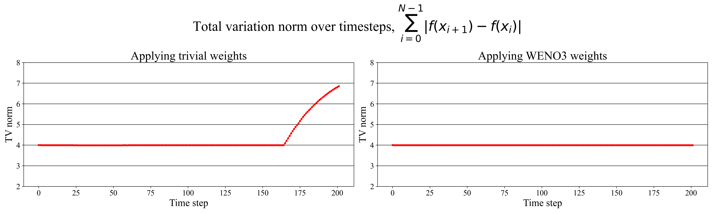
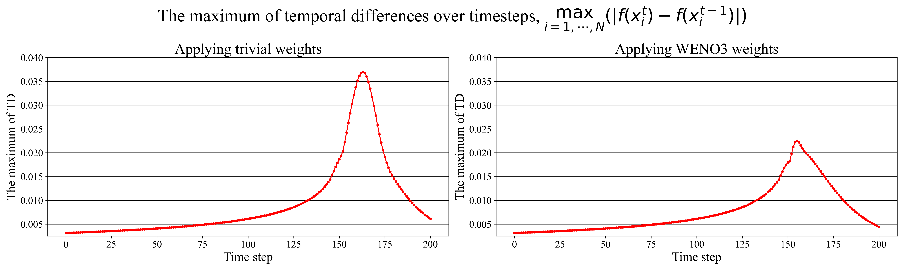

# Solving Hyperbolic Equations via Reinforcement Learninig

## Motivation
Numerically solving a PDE that contains the "shock" solution suffers from osilliation. 
The two animation below show the numerical solutions of Burger's Equation over time. 
 
- The result when applying the trivial weights to 3rd order polynomials

- The result when applying the WENO scheme

## The reward function
The total variation norm of an one dimensional signal is defined by $\sum_{i=1}^{N-1}{|f(x_{i+1})-f(x_{i})|}$.
For a numerical solution that contains the ossilliation, the total variation norm increases over time.
  

We also defined a way to measure osilliation such that
$$\max_{i=1,\cdots,N}(|f({x_i}^{t})-f({x_i}^{t-1})|)$$
at each time step $t=1, \cdots, T$. We referred to it as the maximum value of *temporal differences* over spatial domain at timestep $t$.

## References
[0] Yufei Wang, Ziju Shen, Zichao Long & Bin Dong. (2020). Learning to Discretize: Solving 1D Scalar Conservation Laws via Deep Reinforcement Learning. Communications in Computational Physics. 28 (5). 2158-2179. doi:[10.4208/cicp.OA-2020-0194](https://global-sci.org/intro/article_detail/cicp/18408.html).  
[0] Farahmand, Amir-massoud & Nabi, Saleh & Grover, Piyush & Nikovski, Daniel. (2016). Learning to Control Partial Differential Equations: Regularized Fitted Q-Iteration Approach. [10.1109/CDC.2016.7798966](https://ieeexplore.ieee.org/document/7798966).  
[0] Farahmand, Amir-massoud & Nabi, Saleh & Nikovski, Daniel. (2017). Deep reinforcement learning for partial differential equation control. 3120-3127. [10.23919/ACC.2017.7963427](https://ieeexplore.ieee.org/document/7963427).  

